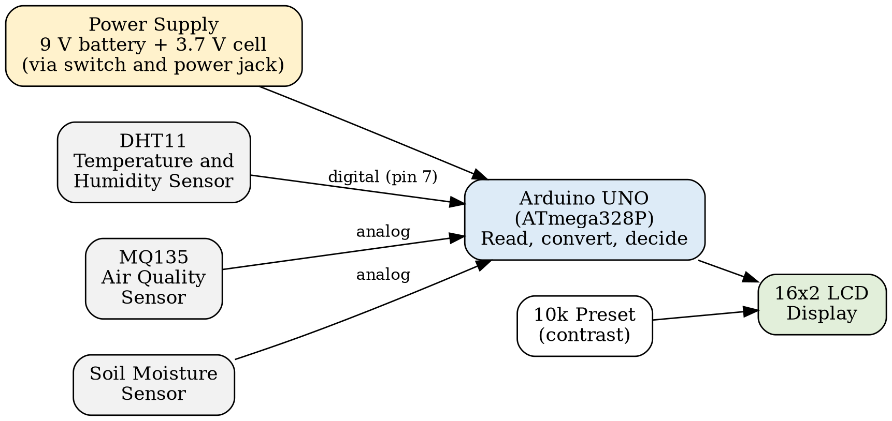
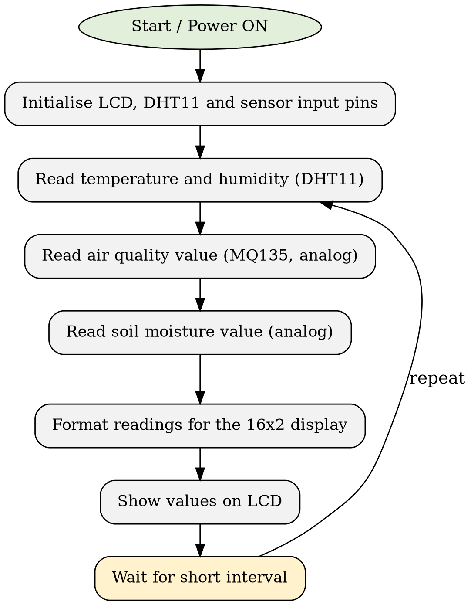
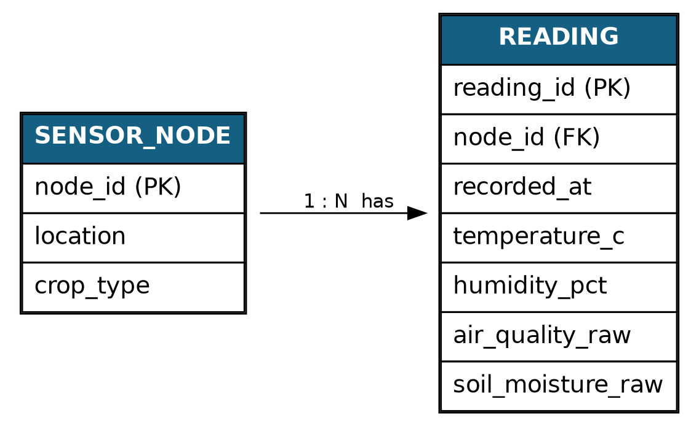

# Smart Agriculture Monitoring System 🌱

A low-cost, battery-powered **Arduino UNO** based system that monitors **soil moisture, air temperature, humidity, and air quality** around crops and plants, and displays the readings live on a 16x2 LCD.

Built as a Capstone Project (SE / Semester III, Computer Engineering) at **St. John College of Engineering & Management, University of Mumbai**.

> This repository documents the project for academic submission. The original hands-on build was referenced from a public demo video (credited below); the documentation, report, presentation, and diagrams in this repo were prepared independently for the capstone submission.

---

## 📌 Overview

Small farms, nurseries, and home gardens still mostly judge soil and air conditions by touch and eyesight — slow, inconsistent, and hard to repeat. This project builds a simple, portable monitoring unit that gives **instant, numeric readings** for four key parameters, without needing a phone, computer, or internet connection.

| Parameter | Sensor | What it tells you |
|---|---|---|
| Soil moisture | Soil Moisture Sensor | Whether the soil is dry or wet |
| Air temperature | DHT11 | Ambient temperature around the plant |
| Humidity | DHT11 | Relative humidity around the plant |
| Air quality | MQ135 | Relative indication of gases/pollutants in the air |

All four readings are shown live on a 16x2 LCD, powered by a 9V battery (with a 3.7V rechargeable cell in series for stable supply).

---

## ✨ Features

- 📟 Live display of 4 environmental parameters on a 16x2 LCD
- 🔋 Fully portable — battery powered, no mains or internet required
- 💰 Low cost — built entirely from common, easily available components
- 📦 Compact enclosure with openings for sensor airflow
- 🎛️ Adjustable LCD contrast via 10k preset
- 🧩 Simple, beginner-friendly circuit — easy to replicate and extend

---

## 🧰 Hardware Components

| # | Component | Purpose |
|---|---|---|
| 1 | Arduino UNO | Main controller — reads sensors, drives the LCD |
| 2 | 16x2 LCD Display | Displays all sensor readings |
| 3 | MQ135 Gas Sensor | Detects changes in air quality |
| 4 | DHT11 Sensor | Measures air temperature and humidity |
| 5 | Soil Moisture Sensor | Detects soil dryness/wetness |
| 6 | 10k Preset (Potentiometer) | Adjusts LCD contrast |
| 7 | Male-to-Female Jumper Wires | Sensor-to-Arduino connections |
| 8 | Female-to-Female Jumper Wires | LCD and sensor connections |
| 9 | Power Jack | Connects battery supply to Arduino |
| 10 | 9V Battery + Battery Cap | Main power source |
| 11 | Switch | Power on/off |
| 12 | 3.7V Rechargeable Battery | In series with 9V battery to improve supply |
| 13 | Wire (~1 metre) | Extends the soil moisture probe outside the enclosure |
| 14 | Enclosure Box | Houses the circuit; vented for air quality sensing |

Full details: [`hardware/components-list.md`](hardware/components-list.md)

---

## 🏗️ System Architecture

<p align="center">
  
</p>

**Data flow:** Sensing → Acquisition (ADC) → Processing (Arduino UNO) → Display (LCD)

- **DHT11** sends temperature & humidity as a digital signal (data pin → Arduino pin 7)
- **MQ135** and **Soil Moisture Sensor** send analog voltages, converted via the Arduino's 10-bit ADC (0–1023)
- The **Arduino UNO** reads all three sensors and formats the values for the **16x2 LCD**

<p align="center">
  
</p>

---

## 🗄️ Data Model (Planned Extension)

> ⚠️ The current prototype is a **standalone unit** — it does not store data. This schema is a **planned future extension** for data logging, included here for documentation completeness.

<p align="center">
  
</p>

| Table | Column | Type | Key |
|---|---|---|---|
| sensor_node | node_id | INT | PK |
| sensor_node | location | VARCHAR(50) | |
| sensor_node | crop_type | VARCHAR(30) | |
| reading | reading_id | INT | PK |
| reading | node_id | INT | FK |
| reading | recorded_at | DATETIME | |
| reading | temperature_c | FLOAT | |
| reading | humidity_pct | FLOAT | |
| reading | air_quality_raw | INT | |
| reading | soil_moisture_raw | INT | |

---

## 🛠️ Tech Stack

| Aspect | Technology |
|---|---|
| Microcontroller | Arduino UNO (ATmega328P) |
| Sensors | DHT11, MQ135, Soil Moisture Sensor |
| Output | 16x2 LCD (contrast via 10k preset) |
| Language / IDE | Arduino C/C++ via Arduino IDE |
| Libraries | DHT sensor library, LiquidCrystal library |
| Power | 9V battery + 3.7V rechargeable cell (series) |
| Connectivity | None — standalone unit |
| Data storage | None (live display only) |

---

## 📂 Repository Structure

```
smart-agriculture-monitoring-system/
├── README.md                      ← you are here
├── LICENSE
├── docs/
│   ├── Project_Report.docx        ← full capstone report (MPCA/SJCEM format)
│   └── Project_Presentation.pptx  ← 10-slide capstone presentation
├── hardware/
│   └── components-list.md         ← detailed BOM with notes
├── firmware/
│   └── README.md                  ← firmware/pin-mapping notes
└── media/
    ├── block-diagram.png
    ├── flowchart.png
    ├── er-diagram.png
    └── college-logo.png
```

---

## 🚀 Getting Started (Replicating the Build)

1. Gather all components listed in [Hardware Components](#-hardware-components).
2. Wire the sensors to the Arduino UNO as described in [`firmware/README.md`](firmware/README.md).
3. Connect the 16x2 LCD and adjust contrast with the 10k preset.
4. Upload the Arduino sketch (see note on firmware below) via the Arduino IDE.
5. Power the circuit with the 9V + 3.7V battery setup through the power jack and switch.
6. Mount everything inside a vented enclosure and extend the soil probe wire outside.

> **Note on firmware:** The original source code for this build is not open-sourced by its creator and is not included in this repository. `firmware/README.md` documents the pin mapping and expected logic so the sketch can be rewritten independently.

---

## 🧪 Testing & Results

| Test Condition | Observation |
|---|---|
| Soil probe in dry soil | Low-moisture (dry) reading displayed |
| Soil probe placed in water | Reading changed clearly to a wet value |
| Air quality — enclosure open vs. closed | Reading changed with enclosure condition |
| Unit placed near plants (open air) | Temperature ~36°C, Humidity ~50% *(verify against your own test run)* |

---


## 🔮 Future Scope

- 📡 ESP32/NodeMCU integration for cloud dashboard / mobile app
- 💾 Data logging using the planned schema above
- 🔔 Buzzer/SMS/app alerts when thresholds are crossed
- 💧 Automatic irrigation via relay + water pump
- 🖨️ Custom PCB and weatherproof enclosure
- 🤖 ML-based plant health / disease prediction

---

## 📚 References

See [`docs/Project_Report.docx`](docs/Project_Report.docx) for the full reference list. Key source:

- VMK Technical Power, "Smart Agriculture Project, Crop & Plants Health Monitoring System, Air Quality Monitoring," YouTube, Sept. 2022. [Watch here](https://www.youtube.com/watch?v=RKP4zovgIyE)

---

## 📄 License

This project is licensed under the [MIT License](LICENSE).

---

## 🙏 Acknowledgements

- Dr. Sunny Sall, Head of Department, Computer Engineering, SJCEM
- Megha Godboley, Project Guide, Assistant Professor, Computer Department, SJCEM
